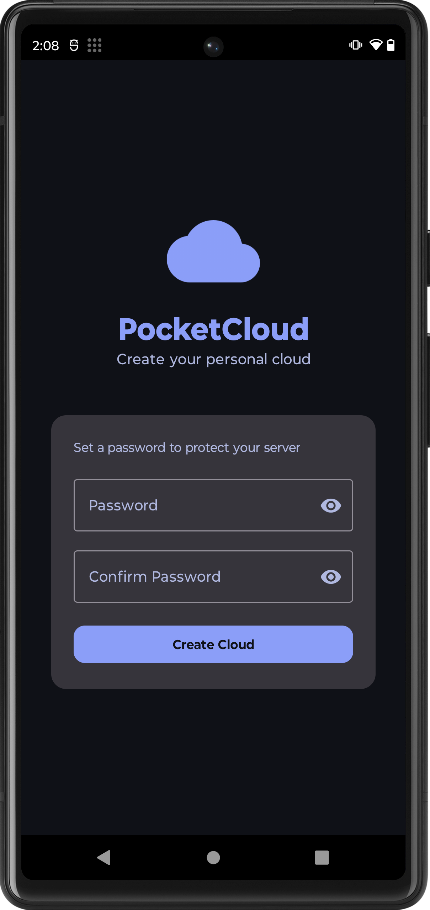
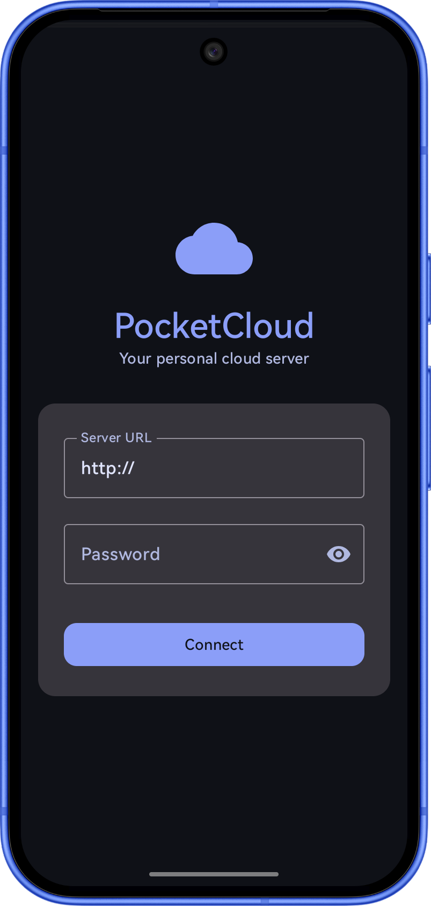

# PocketCloud ☁️

**Turn your old Android phone into a personal cloud server.**

PocketCloud is a free, open-source solution that lets you use an old Android device as a private file server, accessible from your main phone over Wi-Fi or the internet — no subscriptions, no third-party cloud, no data leaving your hands.

---

## Screenshots

  

---

## How it works

PocketCloud consists of two companion apps:

- **PocketCloud Server** — installed on your old device. It runs a lightweight HTTP server in the background, exposing your files through a secure REST API. It stays alive using a foreground service and can auto-start on boot.

- **PocketCloud Client** — installed on your main device. It connects to the server and lets you browse, upload, download, move, rename, and preview all your files remotely.

---

## Features

### Server
- 🔒 JWT authentication with BCrypt password hashing
- 🛡️ Brute-force protection (5 failed attempts = 15 min lockout)
- 📡 Runs in background with WakeLock and WifiLock
- 🔄 Auto-start on device boot
- 📊 Storage usage donut chart
- 🕐 Live server uptime
- 👥 Active connections counter
- 📋 Connection log

### Client
- 📁 Full file system browser with search
- 🖼️ Image thumbnails and preview
- 🎵 Video and audio playback
- 📤 Upload files with progress bar
- 📥 Download files with progress bar
- ✏️ Rename, move, and delete files
- 🔄 Auto-reconnect with saved credentials

---

## Tech Stack

- **Language:** Kotlin
- **UI:** Jetpack Compose + Material Design 3
- **Server:** Ktor (Netty engine) embedded in Android
- **Client:** Ktor HTTP Client
- **Security:** JWT, BCrypt, EncryptedSharedPreferences
- **Min SDK:** 31 (Android 12)

---

## Download

See [download.md](https://github.com/Tpskevin13/PocketCloud/blob/main/DOWLOAD.md) for the latest APKs.

---

## Security

Both APKs have been scanned and verified clean by VirusTotal:

- [VirusTotal Report](https://github.com/Tpskevin13/PocketCloud/blob/main/VIRUSTOTAL.md)

---

## Remote Access

To access your files from outside your home network, install [Tailscale](https://tailscale.com/download/android) on both devices and use your Tailscale IP as the server address.

---

## Setup

1. Install **PocketCloud Server** on your old device
2. Open the app and create a password
3. Tap **Start Server** — your IP and port will appear
4. Install **PocketCloud Client** on your main device
5. Enter the server IP and password and tap **Connect**

---

## Support

If you find PocketCloud useful, consider supporting the project:

See [support.md](https://github.com/Tpskevin13/PocketCloud/blob/main/SUPPORT.md) for more ways to help.

---

## Contributing

See [CONTRIBUTING.md](https://github.com/Tpskevin13/PocketCloud/blob/main/CONTRIBUTING.md) for guidelines.

---

## License

GPL-3.0 — free to use, modify, and distribute.
